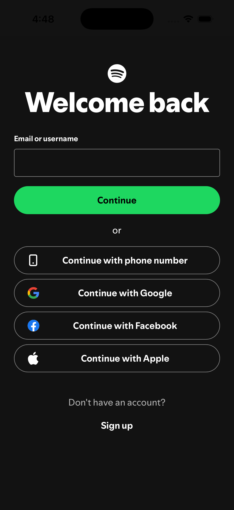

# React Native Spotify Clone 🚧

This is a Spotify Client built using the [Spotify Web API](https://developer.spotify.com/documentation/web-api) as a hobby project, to answer "Can it be done in React Native?"

### Requirements

1. Standard Expo React Native setup for the app to run.
2. Spotify Premium Account.
3. Spotify API Key & Client Secret.

### Setup

Create this file in the project root.

Create a credentials file to store the required api key & secret.

app.credentials.json

```
{
  "SPOTIFY_CLIENT_ID": "<YOUR_ID>",
  "SPOTIFY_CLIENT_SECRET": "<YOUR_SECRET>"
}
```

To Build the app on iOS, run

```
yarn dev:build:ios
```

### Tasks

- [x] Add Currently Playing Support
- [ ] Player Controls
- [ ] Add theme support
- [ ] Side Drawer Clean up
- [ ] Playlists
- [ ] Home Screen UI

#### Progress so far

---




---

This is an [Expo](https://expo.dev) project created with [`create-expo-app`](https://www.npmjs.com/package/create-expo-app).
